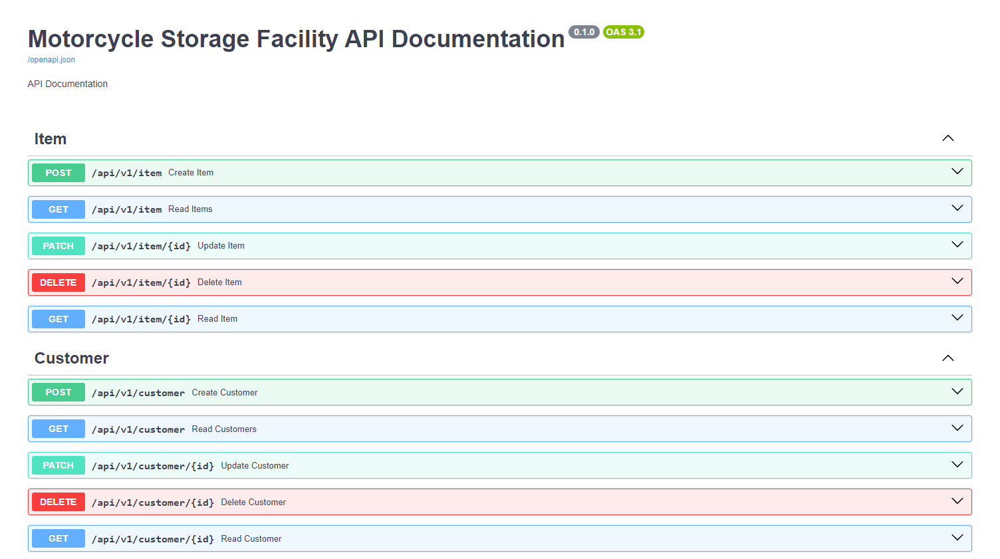
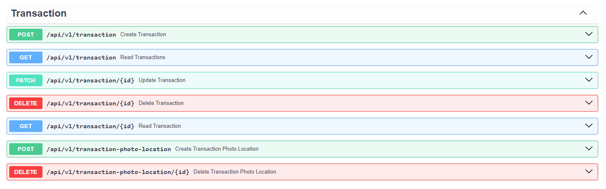

# MotorCycle Storage Facility API

## Preview :

<br>


# Minimun Viable Product

- crud brand
- crud item
- crud customer
- crud transaction
- cd transaction detail photo location

# Description

`alembic`: database migration for manage table

`app`: application configuration

`app.api`: logic of configuration routers

`app.dtos`: data transfer object

`app.models`: model configuration

`app.repositories`: repository of specific business logic function

`app.services`: service of layer between operation and business logic

`app.tests`: test configuration

`app.utils`: reusable function

`static`: external assets directory


# Dependencies:
- [Python 3.12](https://www.python.org/) - Python 3.12
- [FastAPI](https://fastapi.tiangolo.com/) - Framework for Python
- [SQLAlchemy](https://www.sqlalchemy.org/) -  ORM Toolkit for SQL Database
- [MySQL](https://www.mysql.com/) - Database SQL

> Be carefull with python version.
> Always using environment like [anaconda](https://www.anaconda.com/)/[miniconda](https://docs.conda.io/en/latest/miniconda.html)/[virtualenv](https://virtualenv.pypa.io/en/latest/) for setup backend.
> Don't forget to activate environment.

Want to contribute? Great!

## Development

Create python env using miniconda/anaconda

```sh
conda create --name motorcycle-storage-facility-api
```

Activate python env

```sh
conda activate motorcycle-storage-facility-api
```

> Note:  activate environment and set python interpreter to your environment. if using vscode do `ctrl+shift+p` then write `python interpreter`, after that select the right environment
> After select python interpreter, kill terminal in vscode then add terminal to prevent environment still work in global

Duplicate .env.example and renamed it to .env

Fill this variable in .env
```sh
DB="mysql+pymysql://{username}:{password}@{host}:{port}/{database}"
```

You can customize port of deploy web
```sh
PORT=5002
```

Install package

```sh
pip install -r requirements.txt
```

Running Application

```sh
python main.py
```

Look endpoint list in (SWAGGER DOCUMENTATION)

```sh
http://localhost:8000/docs
```

## GENERATE KEY FOR PRIVATE_KEY, PUBLIC_KEY, REFRESH_PRIVATE_KEY

generate private key

```sh
openssl genrsa -out private.pem 2048
```

generate public key

```sh
openssl rsa -in private.pem -outform PEM -pubout -out public.pem 
```

generate private key for refresh

```sh
openssl genrsa -out private-refresh.pem 2048
```

## DATABASE SETUP - MIGRATION

duplicate alembic.ini.example and rename to alembic.ini

set url alembic.ini with valid configuration

initial alembic

```sh
alembic init alembic
```

create migration file

```sh
alembic revision -m "create {name} table"
```

upgrade file

```sh
alembic upgrade head
```

upgrade file from exec container

```sh
docker exec -it <container_id_or_name> alembic upgrade head
```

downgrade latest file


```sh
alembic downgrade -1
```

### Live Server

Keep nginx already installed

Change Directory to /var/www/html
```sh
cd /var/www/html
```

Clone this repository
```sh
git clone thisurl motorcycle-storage-facility-api
```

Pull repository
```sh
git pull
```

duplicate .env.example and rename it to .env then fill the right variable (look up)

Up container to server
```sh
docker-compose up -d --build
```

restart container to server
```sh
docker-compose restart
```

Cleaning unused volume, container and all related docker
```sh
sudo docker system prune --all --force --volumes
```

Down container to server
```sh
docker-compose down
```

#### Set up web server nginx

Change Directory to /var/www/html
```sh
sudo nano /etc/nginx/sites-available/{create-domain.conf}
```

copy this code and modify
```sh
# comment server syntax this if server there not running on https (from listen 80 to return 301) 
server { 
    listen 80; 
    server_name {create-domain}; # server name (give the valid domain) 
    return 301 https://$host$request_uri;   
} 
server { 
    # listen 80; # uncomment this if server not running on http 
    # listen [::]:80; # uncomment this if server not running on http 
    listen 443 ssl; # to ssl (comment this if server not running on https)  
    server_name {create-domain}; # give the valid domain or comment this to running from ip and port 
    ssl_certificate /etc/letsencrypt/live/{create-domain}/fullchain.pem; # comment this if there no cert ssl 
    ssl_certificate_key /etc/letsencrypt/live/{create-domain}/privkey.pem; # comment this if there no cert ssl 

    location / { 
        proxy_pass http://localhost:{port}; # change this port with valid port 
      proxy_set_header Host $host; 
        proxy_set_header X-Real-IP $remote_addr; 
        proxy_set_header X-Forwarded-For $proxy_add_x_forwarded_for; 
        proxy_set_header    X-Forwarded-Proto $scheme;  
    } 
}
```

activate symbioc
```sh
sudo ln -s /etc/nginx/sites-available/{create-domain.conf} /etc/nginx/sites-enabled/
```


remove symbioc
```sh
sudo rm /etc/nginx/sites-enabled/{create-domain.conf}
```

Check configuration
```sh
sudo nginx -t
```

Check configuration
```sh
sudo systemctl restart nginx
```